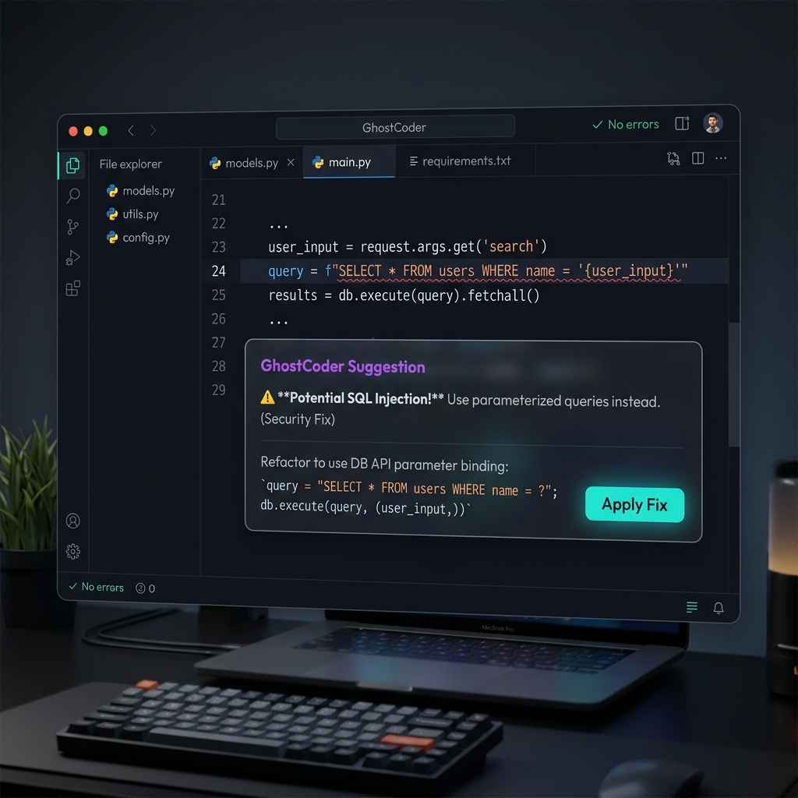

# 👻 GhostCoder

**The AI coding partner that doesn't trust itself.**



[](https://github.com/anujsingh-cse/GhostCoder/actions)
[](https://pypi.org/project/ghostcoder/)
[](https://opensource.org/licenses/MIT)

## Why GhostCoder?

| | Cursor | Copilot | GhostCoder |
|--|--------|---------|------------|
| UI | Sidebar chat | Inline completion | **No UI. Inline hints only** |
| Trust | You trust the AI | You trust the AI | **AI challenges itself** |
| Audit | None | None | **Full replay + explain** |
| Safety | None | None | **Guardrails block dangerous** |
| Cost | $20/mo | $10/mo | **Free, local, MIT** |
| Hardware | Cloud | Cloud | **GTX 1650 4GB** |

## Three Features Nobody Else Has

### 🔍 Inline Hints
Specialist agents watch your code and whisper fixes. No sidebar. No context switching.

When you run a command that fails, or write code with an obvious bug, GhostCoder classifies the error and routes it to the correct specialist agent (e.g., security engineer, database optimizer, frontend developer) to give you a dismissible inline hint.

### 🔁 Ghost Replay
Every decision is recorded, explainable, and replayable. 

If you want to understand why GhostCoder suggested a particular change or see a step-by-step trace of how an error was handled, you can inspect it or run a full replay.

```bash
# Explain what happened in a specific session event
ghostcoder explain --session 20260716-001 --event 0

# Generate a project automation report (weekly/monthly)
ghostcoder report --period week

# Re-apply proposed fixes from a session
ghostcoder replay --session 20260716-001
```

### 🛡️ Ghost Skeptic & Safety Guardrails
GhostCoder is the first coding assistant that validates its own output. 

- **Ghost Skeptic**: Uses an adversarial classifier model to look for logic flaws and security issues (e.g. plaintext credentials) in every suggested fix. If a flaw is detected, it is either corrected or blocked.
- **Safety Guardrail**: Automatically screens proposed code blocks for database-destructive operations (`DROP DATABASE`) or risky directory deletions (`rm -rf`) to keep your workspace safe.

---

## Model Agnostic & GPU Auto-Scaling

GhostCoder is **completely model-agnostic** and works with any Large Language Model supported by your local Ollama instance (including Llama 3, DeepSeek, Mistral, Qwen, Codellama, etc.).

By default, GhostCoder automatically detects your local GPU resources and dynamically routes requests to the largest model that fits comfortably in your VRAM budget (up to 85% utilization).

### GPU Tiers & Recommendations

| VRAM Capacity | Tier Profile | Classifier Model | Coder Model | Reasoner Model | Skeptic Model |
| :--- | :--- | :--- | :--- | :--- | :--- |
| **< 6 GB** | `entry` | `qwen2.5:0.5b` | `qwen2.5-coder:1.5b` | `qwen2.5-coder:1.5b` | `qwen2.5:0.5b` |
| **6 - 12 GB** | `mid` | `qwen2.5:0.5b` | `qwen2.5-coder:7b` | `qwen2.5-coder:7b` | `qwen2.5:0.5b` |
| **12 - 20 GB** | `high` | `qwen2.5:0.5b` | `qwen2.5-coder:14b` | `deepseek-coder:6.7b` | `qwen2.5:3b` |
| **20 - 48 GB** | `workstation` | `qwen2.5:3b` | `qwen2.5-coder:32b` | `deepseek-coder:33b` | `qwen2.5:7b` |
| **>= 48 GB** | `datacenter` | `qwen2.5:7b` | `qwen2.5-coder:72b` | `deepseek-coder:33b` | `qwen2.5:14b` |

### Customizing Your Model Configuration
You can hot-swap any role to run any custom model pulled locally:

```bash
# Configure coder model to use Llama 3
ghostcoder config --model-coder llama3:8b

# Configure skeptic model to use Mistral
ghostcoder config --model-skeptic mistral:7b
```

---

## Quick Start

### 1. Prerequisites
Install [Ollama](https://ollama.com/) and pull the models you want to use. For the default Entry configuration:
```bash
ollama pull qwen2.5:0.5b
ollama pull qwen2.5-coder:1.5b
```

### 2. Install GhostCoder
Install the CLI and background daemon:
```bash
pip install ghostcoder
```

### 3. Initialize Integrations
Configure your shell and start the daemon:
```bash
ghostcoder init
```
This automatically appends source lines to your shell configuration (`.bashrc`, `.zshrc`, or `config.fish`) and launches the background daemon.

---

## Editor & IDE Setup

### Neovim
Add the plugin folder to your runtimepath (e.g., using your package manager):
```lua
-- lazy.nvim configuration example
{
  "anujsingh-cse/GhostCoder",
  config = function()
    -- Integration works automatically over the Unix Domain Socket
  end
}
```

### VS Code
1. Open the `vscode` folder in this repository.
2. Package the extension:
   ```bash
   cd vscode
   npm install
   npm run compile
   npx vsce package
   ```
3. Install the generated `.vsix` file in VS Code.

---

## CLI Command Reference

- `ghostcoder start` - Start the background daemon.
- `ghostcoder status` - Show active models, VRAM usage, and active integrations.
- `ghostcoder logs` - Tail background daemon log output.
- `ghostcoder stop` - Stop the daemon gracefully.
- `ghostcoder skeptic --on|--off` - Enable or disable the skeptic validation agent.

---

## License

This project is licensed under the MIT License - see the [LICENSE](LICENSE) file for details.
