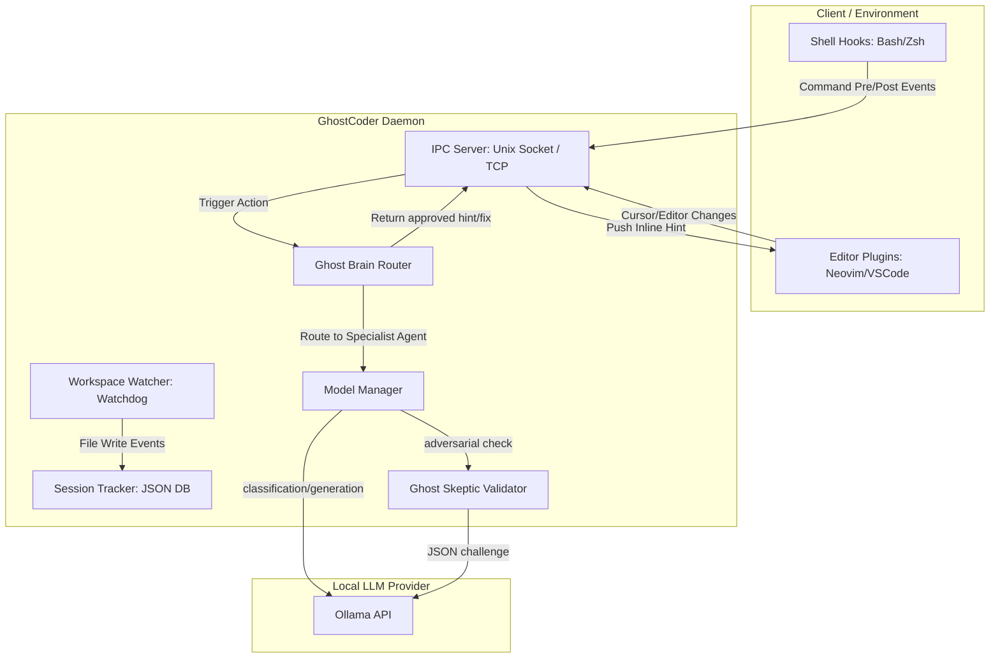

# 🏗️ Architecture Guide

GhostCoder operates as a decentralized, event-driven assistant running entirely locally. It bridges the gap between your workspace (IDE/Editor), your terminal (Shell), and local Large Language Models (via Ollama) without requiring any cloud APIs or external telemetry.

---

## 📡 The Daemon & IPC Protocol
The background daemon (`ghostcoder start`) starts an asynchronous server. By default, it attempts to bind to a Unix Domain Socket at `~/.ghostcoder/ghostcoder.sock`. If running on an unsupported platform or environment, it falls back to a local loopback TCP port (`48673`).

### Core IPC Message Schema
Clients (IDE plugins, shell wrappers) exchange JSON payloads terminated by newlines (`\n`):

*   **`editor_change`**: Sent by the IDE on cursor movement or document modification. Contains file paths, active lines, and raw buffer contents.
*   **`command_pre` / `command_post`**: Sent by shell hook scripts when a terminal command is run and when it finishes (capturing status codes and stderr output).
*   **`status_request`**: Queried by the CLI to retrieve active VRAM consumption, GPU tier metrics, loaded models, and stack definitions.
*   **`reload_config`**: Used by the CLI client to notify a running daemon of configuration changes, triggering hot-swapping of models.

---

## 🧠 Ghost Brain Routing
When an event (like a command failure or code edit matching a structural vulnerability) is sent to the daemon, the **Ghost Brain Router** resolves the context:

1.  **Tech Stack Detection**: It inspects file extensions and manifests to identify project technologies (e.g., Node.js, Python, Rust).
2.  **Specialist Agent Selection**: The classification model routes the situation to the most relevant engineering specialist (e.g., `agency-application-security-engineer`, `agency-devops-automator`, or `agency-senior-developer`).
3.  **Prompt Assembly**: The system prompt is dynamically assembled from the selected agent's instructions.
4.  **Generation & Skeptic Validation**: The suggestion is produced by the Coder model and validated by the Ghost Skeptic before being returned to the IDE.

---

## 💾 Session Tracker & Replay DB
All events, raw error messages, model prompts, and user interactions (apply, dismiss) are logged to a local JSON database at `~/.ghostcoder/sessions/`. This transaction log serves as the single source of truth for replay automation and explanation commands.
